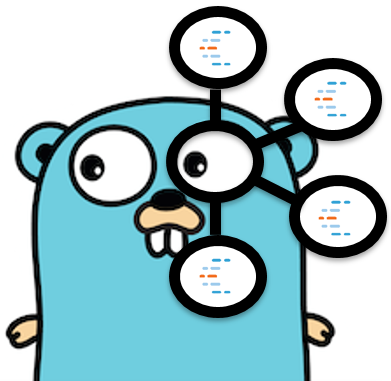

Golang Client for Confluent's Schema Registry
=====================================================



**srclient** is a Golang client for [Confluent Schema Registry](https://www.confluent.io/confluent-schema-registry/), a service that provides a RESTful interface for developers to define standard schemas for their events, share them across the organization and safely evolve them in a way that is backward compatible and future proof. By using this client, developers building Go applications can interact with Schema Registry and fetch schemas for their applications to use to serialize and/or deserialize records using [Apache Avro](https://avro.apache.org/).

Features:

- **Simple to Use** - This client provides a very high-level abstraction over the operations that developers writing applications for [Apache Kafka](https://kafka.apache.org/) typically need. Thus, it will feel natural for them using the functions that this client provides. Moreover, developers don't need to handle low-level HTTP details to communicate with Schema Registry.

- **Performance** - This client provides caching capabilities. This means that any data retrieved from Schema Registry can be cached locally to improve the performance of subsequent requests. This allows applications that are not co-located with Schema Registry to reduce the latency necessary on each request. This functionality can be disabled programmatically.

- **Confluent Cloud** - Go developers using [Confluent Cloud](https://www.confluent.io/confluent-cloud/) can use this client to interact with the fully managed Schema Registry, which provides important features like schema enforcement that enable teams to reduce deployment issues by governing the schema changes as they evolve.

This client creates codec's based on the Avro support from the [goavro](https://github.com/linkedin/goavro) project. Developers can use these codec's to encode and decode from both binary and textual JSON Avro data. If you are using generated code based on Avro compilers, you can disable the codec creation programmatically.

**License**: [Apache License v2.0](http://www.apache.org/licenses/LICENSE-2.0)

Installing
-------------------

Manual install:
```bash
go get -u github.com/riferrei/srclient
```

Golang import:
```golang
import "github.com/riferrei/srclient"
```

Examples
-------------------

**Producer**

```golang
import (
	"encoding/binary"
	"encoding/json"
	"fmt"
	"io/ioutil"

	"github.com/google/uuid"
	"github.com/riferrei/srclient"
	"gopkg.in/confluentinc/confluent-kafka-go.v1/kafka"
)

type ComplexType struct {
	ID   int    `json:"id"`
	Name string `json:"name"`
}

func main() {

	topic := "myTopic"

	// Create the producer as you would normally do
	p, err := kafka.NewProducer(&kafka.ConfigMap{"bootstrap.servers": "localhost"})
	if err != nil {
		panic(err)
	}
	defer p.Close()

	// Delivery report handler for produced messages
	go func() {
		for e := range p.Events() {
			switch ev := e.(type) {
			case *kafka.Message:
				if ev.TopicPartition.Error != nil {
					fmt.Printf("Delivery failed: %v\n", ev.TopicPartition)
				} else {
					fmt.Printf("Delivered message to %v\n", ev.TopicPartition)
				}
			}
		}
	}()

	// Fetch the latest version of the schema, or create the first one
	schemaRegistryClient := srclient.CreateSchemaRegistryClient("http://localhost:8081")
	schema, err := schemaRegistryClient.GetLatestSchema(topic, false)
	if schema == nil {
		schemaBytes, _ := ioutil.ReadFile("complexType.avsc")
		schema, err = schemaRegistryClient.CreateSchema(topic, string(schemaBytes), false)
		if err != nil {
			panic(fmt.Sprintf("Error creating the schema %s", err))
		}
	}
	schemaIDBytes := make([]byte, 4)
	binary.BigEndian.PutUint32(schemaIDBytes, uint32(schema.ID))

	// Create the record using the codec from the schema
	newComplexType := ComplexType{ID: 1, Name: "Gopher"}
	value, _ := json.Marshal(newComplexType)
	native, _, _ := schema.Codec.NativeFromTextual(value)
	valueBytes, _ := schema.Codec.BinaryFromNative(nil, native)

	// Assemble the record
	var recordValue []byte
	recordValue = append(recordValue, byte(0))
	recordValue = append(recordValue, schemaIDBytes...)
	recordValue = append(recordValue, valueBytes...)

	// Produce the record to the topic
	key, _ := uuid.NewUUID()
	p.Produce(&kafka.Message{
		TopicPartition: kafka.TopicPartition{
			Topic: &topic, Partition: kafka.PartitionAny},
		Key: []byte(key.String()), Value: recordValue}, nil)

	// Wait for message deliveries before shutting down
	p.Flush(15 * 1000)

}
```

**Consumer**

```golang
import (
	"encoding/binary"
	"fmt"

	"github.com/riferrei/srclient"
	"gopkg.in/confluentinc/confluent-kafka-go.v1/kafka"
)

func main() {

	c, err := kafka.NewConsumer(&kafka.ConfigMap{
		"bootstrap.servers": "localhost",
		"group.id":          "myGroup",
		"auto.offset.reset": "earliest",
	})
	if err != nil {
		panic(err)
	}

	c.SubscribeTopics([]string{"myTopic", "^aRegex.*[Tt]opic"}, nil)
	schemaRegistryClient := srclient.CreateSchemaRegistryClient("http://localhost:8081")

	for {
		msg, err := c.ReadMessage(-1)
		if err == nil {
			// Retrieve the schema id from the record value
			schemaID := binary.BigEndian.Uint32(msg.Value[1:5])
			// Load the schema from Schema Registry and create
			// a codec from it. Use it later to deserialize the
			// the record value.
			schema, err := schemaRegistryClient.GetSchema(int(schemaID))
			if err != nil {
				panic(fmt.Sprintf("Error getting the schema associated with the ID '%d' %s", schemaID, err))
			}
			// Deserialize the record value using the codec
			native, _, _ := schema.Codec.NativeFromBinary(msg.Value[5:])
			value, _ := schema.Codec.TextualFromNative(nil, native)
			// Print the record value
			fmt.Printf("Message on %s: %s\n", msg.TopicPartition, string(value))
		} else {
			fmt.Printf("Consumer error: %v (%v)\n", err, msg)
		}
	}

	c.Close()
	
}
```

Both examples have been created using [Confluent's Golang for Apache Kafka<sup>TM</sup>](https://github.com/confluentinc/confluent-kafka-go).

Contributing
------------
Contributions to the code, examples, documentation, et.al, are very much appreciated.